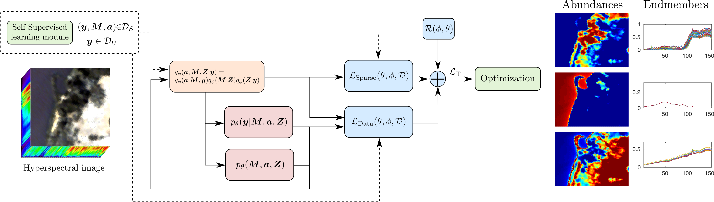

# Learning Interpretable Deep Disentangled Neural Networks for Hyperspectral Unmixing


This package contains the implementation of ID-Net algorithm proposed in the paper [1].


The code consists of an interpretable deep learning method for hyperspectral unmixing that accounts for nonlinearity and endmember variability. It leverages a probabilistic variational deep-learning framework, where disentanglement learning is employed to properly separate the abundances and endmembers. The model is learned end-to-end using stochastic backpropagation, and trained using a self-supervised strategy which leverages benefits from semi-supervised learning techniques. The model is designed to provide a high degree of interpretability.





## Usage

### Downloading the datasets used in the paper

The datasets are available in Zenodo [here](https://zenodo.org/record/8360465), https://doi.org/10.5281/zenodo.8360465. Please download them and include the correct paths to them in the beginning of the `DataGeneration.py` file to be able to run the examples.


### Running with the original data

To run the method using the datasets used in the paper, just run `main_IDNet.py` with the appropriate dataset selected in the `EX_NUM` variable in the beginning of the main function.


The results are saved in `.mat` format in the `results` folder. They contain the variables:  
-  `A_est` : estimated abundance maps. 
-  `A_true` : ground-truth values for the abundances, when available for the experiments with synthetic data.  
-  `Mn_est` : estimated endmembers for each pixel of the image.  
-  `Mn_true` : ground truth of the endmembers for each pixel of the image, when available for the experiments with synthetic data.  
-  `Y_rec` : the hyperspectral image reconstructed by the algorithm.  
-  `a_nlin_deg` : the "degree of nonlinearity" in the estimated abundances (see the experimental section of the paper for a precise definition).  


### Running with other data

The datasets are loaded in the `DataGeneration.py` file and follow the Pytorch dataloader format. To use your own image or dataset, you can edit or replicate one of the existing dataloader classes in this file to load the new data accordingly. The simplest way is to substitute the files from one of the examples with real data, for instance, of the Samson image, defined in the paths as:
```
path_dataset_Samson = ['DATA/real_Samson/alldata_real_Samson.mat',\
                       'DATA/real_Samson/extracted_bundles.mat']
```

There are two `.mat` files that need to be loaded. The first file (`alldata_real_Samson.mat` in the above example) should contain three numpy arrays:  
-  `Y` : a matrix of size `num_bands * pixels` containing the hyperspectral image ordered as a matrix. 
-  `Yim` : an array of size `num_bands * num_rows * num_cols` containing the image ordered as a tensor/cube.   
-  `M0` : a matrix of size `num_bands * num_endmembers ` containing a sample/reference endmember matrix (it can be extracted from `Y` using, e.g., the VCA algorithm).  


The second file (`extracted_bundles.mat` in the above example) should contain a set of spectral libraries for each endmember:  
-  `bundleLibs` : an array of dimension `1 * num_endmembers`, where each element of the array is itself an array of size `num_bands * size_of_the_library` containing different samples of each endmember.  


The spectral libraries can be extracted from the image itself, for how to do that, see the paper or section V-A1 of [this paper](https://arxiv.org/pdf/2001.07307.pdf). For your convenience, a set of Matlab functions that can be used for this task are included in the `library_extraction` folder, see the `library_extraction_example.m` file for an example.


## REFERENCE:
If you use this software please cite the following in any resulting publication:

    [1] Learning Interpretable Deep Disentangled Neural Networks for Hyperspectral Unmixing
        R.A. Borsoi, D. Erdogmus, T. Imbiriba.
        IEEE Transactions on Computational Imaging, 2023.

